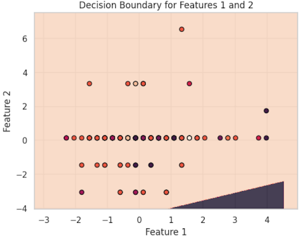
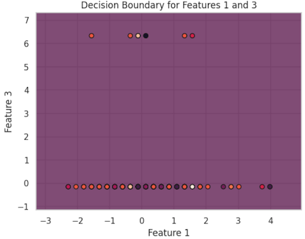
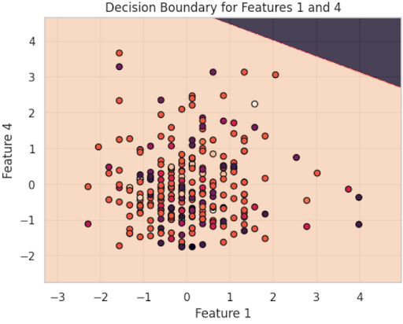
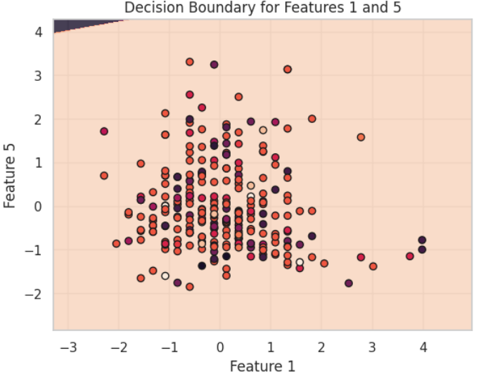
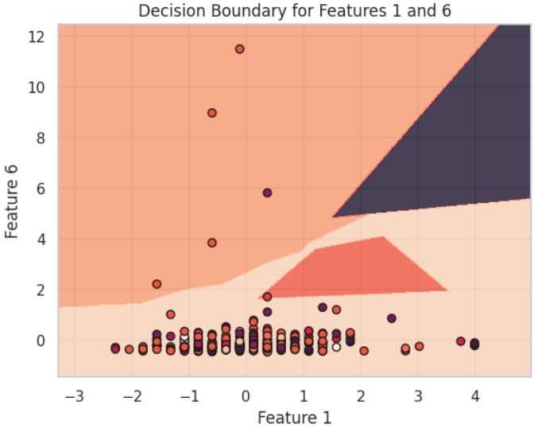
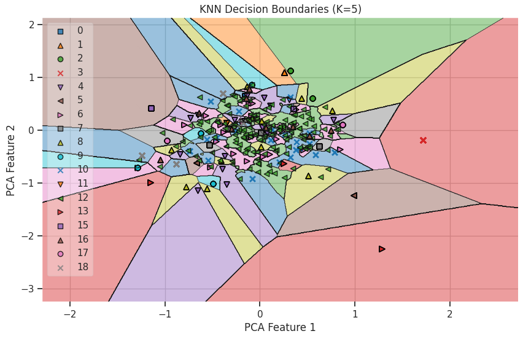
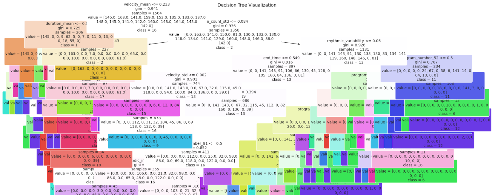

# CSE 151A Project: Song Genre Predictions     <a target="_blank" href="https://colab.research.google.com/drive/19ArXW2768P2VxWBXff0s5CjbLbCtjqJk?usp=sharing">  </a>

## Introduction: 
Imagine a world with no music, no songs to lift your spirits, no melody to soothe the soul, and no beats to keep you moving. Music is more than sound but a universal heartbeat of humanity, weaving emotions, memories, and cultures into shared experiences that speak louder than words. Our group’s initial interest in music was crucial in deciding our model. Music has played significant roles in our lives, whether it was a relaxing listening experience during a study session or an upbeat song to hype yourself up during a workout. As a group, we wanted to bridge the world of music and the possibilities of machine learning together. The model we developed involves taking in a list of MIDI files from the Lakh Midi dataset and predicting the genre of each song snippet based on key elements, including tempo, instruments, and melody. The impact of perfecting a song genre prediction model involves several useful implications like improved user experiences and creative collaborations. Many music platforms like Spotify and Apple Music leverage this model to refine recommendations better to overall make music exploration more intuitive and satisfying to users. Additionally, many musicians can use the model predictions to perform cross-genre blending, which is a creative form of distinct blending elements, techniques, or characteristics of different music genres to create a new and unique musical style. Kendrick Lamar’s incorporation of jazz rhythm with hip-hop beats and Taylor Swift’s blending of pop melodies with country instrumentation are just some examples of cross-genre blending in the modern media. By seamlessly combining the analytical power of machine learning with the emotive essence of music, our model not only enhances the way listeners discover and enjoy music but also empowers artists to push creative boundaries, fostering innovation and cultural connection in a universally resonant art form. In doing so, it bridges technology and artistry, enriching the global music landscape for both creators and audiences alike.

## Methods: 

### Data Exploration:
Data exploration was conducted to compute a comprehensive set of musical features from MIDI files. The provided function compute_statistics was used to extract various metrics for characterizing the musical content. It was important to first extract key features that are not only available for all file samples but each feature needed to have the potential to allow the model to distinguish each genre clearly without leaving any ambiguity. An example of an ambiguous or nonhelpful feature would be program numbers for indication of the types of instruments in a song. We’ve noticed that features like these are less helpful since many genres use the same instrumentation. We needed features that focused on the model’s possible prediction scope. In other words, the more genres a feature can eliminate the more helpful the feature can be for the model’s performance. Within our data exploration function we developed extracts of the song’s basic structure, rhythmic features, and melodic features. 

` 'n_instruments': len(pm.instruments) `

A MIDI file’s basic structures include the number of instruments, key numbers, and time signatures. These basic structures provide foundational information about the musical composition. The number of instruments for example can be the key indication between a classical symphony or a rock song. A large number of instruments oftentimes correlate with orchestral genres like classical or cinema while in few instruments are common in minimalist genres like folk and acoustic. 

```'tempo_estimate': pm.estimate_tempo() ```

Rhythmic features on the other hand capture the temporal structure and variability of the MIDI song file. In the function above we have tempo_estimate, rhythmic_variability, and has_drums. For instance, tempo_estimate can highlight a fast-paced drum or bass track with a tempo of 160-180 BPM while slow blues will have a tempo of 60-80 BPM. Extracting tempo is fundamental to rhythm and correlates with the energy and mood of a song. Generally, you will see faster tempos being closely associated with energetic genres like metal and slower tempos with reflective genres like blues or classical. Finally, melodic features capture tonal or pitch-related elements of the MIDI song. 

```
melodic_intervals = []
  for inst in pm.instruments:
    if inst.notes:
      melodic_intervals += [abs(inst.notes[i + 1].pitch - inst.notes[i].pitch)
      for i in range(len(inst.notes) - 1)]):
        avg_melodic_interval = sum(melodic_intervals) / len(melodic_intervals) if melodic_intervals else 0
```

For melodic features, we extracted avg_melodic_interval and key_modulations. Demonstrated in the function, we extracted the avg_melodic_interval denoted by semitones. A classical symphony would have an average melodic interval of 4-6 semitones which reflects complex and wide-ranging melodies while a pop song will have a typical 1-2 semitones as the melody tends to be simple and catchier. The large interval of average melodies will oftentimes demonstrate complexity found in classical, jazz, and progressive genres. Smaller intervals of average melodies will indicate straightforward melodies common in pop, folk, and children’s music. In summary of our data exploration, the features extracted by the compute_statistic function create a comprehensive profile that allows for accurate music genre classification and a deeper understanding of musical composition for the model to make a certain decisive genre prediction.

### Preprocessing: 

Preprocessing for our model included steps of imputations, feature extractions, one hot encoding, training/testing sets, and resampling. Each of these steps ensures data quality to address missing values, normalizing the scales, and standardizing formats. Feature preprocessing also enhances predictive power by creating meaningful, derived features. Finally, our preprocessing will prepare data in a format suitable for machine learning models while maintaining its representativeness and balance. 

```
# Separate numeric and non-numeric data
numeric_cols = df_dict.select_dtypes(include=np.number).columns
non_numeric_cols = df_dict.select_dtypes(exclude=np.number).columns


# Handle numeric columns
numeric_imputer = SimpleImputer(strategy='most_frequent')
df_numeric = pd.DataFrame(
    numeric_imputer.fit_transform(df_dict[numeric_cols]),
    columns=numeric_cols
)


print(df_numeric)
# Handle non-numeric columns
df_non_numeric = df_dict[non_numeric_cols].copy()
```

Our preprocessing step in our model is to separate the numeric and non-numeric data. This step allows us to apply the appropriate preprocessing techniques to each feature. Some features like n_instruments and tempo_estimate are represented as a single decimal value. A few of the non-numeric data we have are has_drums and note_counts. It is important to separate these features away from other features that may require extra extraction or encoding because single numerical values are already well represented and make the process of preprocessing other features that may require additional techniques easier to preprocess when they are separated. In other words, we do not want to encode avg_melodic_interval when trying to encode the has_drums feature. Treating numeric data as categorical or vice versa can lead to errors or incorrect model performance.

```
numeric_imputer = SimpleImputer(strategy='most_frequent')
df_numeric = pd.DataFrame(
    numeric_imputer.fit_transform(df_dict[numeric_cols]),
    columns=numeric_cols
)
```

The next step involves handling missing data, a crucial preprocessing task for ensuring the quality of our dataset before model training. Missing data is a common issue in many real-world datasets, and the Lakh MIDI dataset is no exception. To address this, we use the SimpleImputer function to fill in missing values in our features. Specifically, we impute missing numeric values with the most frequent value in the dataset. This method was chosen deliberately over alternatives like mean or median imputation to minimize the risk of introducing bias.

Using the mean or median for imputation could result in values that do not align well with any specific genre in the dataset, as these methods aggregate across the entire distribution. This could distort the dataset's representation of individual genres, given that the Lakh MIDI dataset contains MIDI song files spanning diverse musical styles, each with its unique range of feature values. By imputing the most frequent value, we aim to replace missing data with values that are more reflective of the dominant patterns within each genre. This approach helps preserve the integrity of the dataset’s genre-specific characteristics, ultimately leading to better performance and generalization of our model when classifying or analyzing music data.

```
note_counts = df_dict['note_counts']
note_counts = note_counts.apply(eval)
# Define a function to compute features for each list of note counts
def compute_note_count_features(x):
    if not x or len(x) == 0:  # Handle empty lists
        return pd.Series({
            'note_count_mean': np.nan,
            'note_count_std': np.nan,
            'note_count_sum': 0,
            'note_count_entropy': 0,
        })
    return pd.Series({
        'note_count_mean': np.mean(x),
        'note_count_std': np.std(x),
        'note_count_sum': np.sum(x),
        'note_count_entropy': entropy(x) if len(x) > 1 else 0
    })


avg_durations = df_dict['avg_note_durations']
avg_durations = avg_durations.apply(eval)
avg_durations_features = avg_durations.apply(
    lambda x: pd.Series({
        'duration_mean': np.mean(x) if len(x) > 0 else np.nan,
        'duration_std': np.std(x) if len(x) > 0 else np.nan
    })
)

avg_velocities = df_dict['avg_velocities']
avg_velocities = avg_velocities.apply(eval)
avg_velocities_features = avg_velocities.apply(
    lambda x: pd.Series({
        'velocity_mean': np.mean(x) if len(x) > 0 else np.nan,
        'velocity_std': np.std(x) if len(x) > 0 else np.nan
    })
)
```
Next, we address the non-numeric data in our dataset, many of which are represented as lists. These include features such as note_count, which indicates the number of notes played by each instrument, and avg_melody_interval, which measures the average interval between melodic notes. Handling lists in their raw form is problematic because machine learning models typically require fixed-length numeric inputs for effective training and inference. Lists, being variable in length and structure, cannot be directly fed into these models.

To address this challenge, we perform feature extraction on these lists by representing them with their statistical summaries, such as the average, standard deviation, and sum. This approach is beneficial for several reasons:
- Dimensionality Reduction: By summarizing the lists into a few key statistical metrics, we reduce the complexity of the data, making it easier for the model to process while retaining essential information about the feature's distribution.
- Preservation of Patterns: The average captures the central tendency of the data, the standard deviation reflects variability, and the sum provides an aggregate measure. These metrics provide a summary of the list’s characteristics which allows the model to learn effectively without losing any information.
- Compatibility with the Machine Learning Models: The fixed-length numeric summaries transform the variable-length lists into features that can integrate with standard machine learning pipelines. This ensures that all input features conform to the requirements of algorithms like decision trees, SVM, and KNN later on.
  
```
program_numbers_encoded = program_numbers.apply(one_hot_encode, args=(all_program_numbers,))
program_numbers_encoded.columns = [f"program_number_{col}" for col in program_numbers_encoded.columns]
```

One-hot encoding is introduced to handle features represented as lists where each value signifies important categorical information. For example, in the program_numbers feature, the list contains binary values where a 1 at a specific index indicates the presence of a particular instrument in the song. This encoding is crucial because it transforms such categorical data into a format that machine learning models can effectively interpret. By converting these lists into a binary matrix where each column corresponds to a specific category (or instrument, in this case), one-hot encoding ensures that the data is both model-friendly and non-hierarchical. Unlike ordinal encoding, which might impose an unintended relationship among categories, one-hot encoding treats all categories as equally distinct, which is essential for features like program_numbers where no inherent hierarchy exists among instruments. 

```
# Combine numeric and processed non-numeric columns
df_processed = pd.concat([df_numeric, note_counts_features, avg_velocities_features, avg_durations_features], axis=1)
# df_processed = pd.concat([df_numeric], axis=1)


# Scale numeric data
scaler = MinMaxScaler()
df_scaled = pd.DataFrame(
    scaler.fit_transform(df_processed),
    columns=df_processed.columns
)
```

The following code demonstrates the scaling of our data. Scaling is an important preprocessing step in machine learning because it ensures that all features are on a similar scale, preventing features with larger ranges from dominating the training process. Without scaling, models that rely on distance metrics, such as k-nearest neighbors or support vector machines, may produce biased results due to disproportionate influence from larger-scale features. We used the MinMaxScaler function, which scales the data to a specified range, typically between 0 and 1. MinMax scaling is particularly beneficial in our case, where we are creating a model to predict the genre category from a MIDI file. Unlike standard scaling, which transforms data to have a mean of 0 and a standard deviation of 1, MinMax scaling preserves the original distribution of the data while normalizing its range. This characteristic is important for our dataset because MIDI features, such as note counts or melodic intervals, often have meaningful lower and upper bounds. By preserving these bounds, MinMax scaling ensures that the scaled data retains its interpretability and that all features contribute equitably to the model's learning process.

```
label_encoder = LabelEncoder()
expanded_df['genre_encoded'] = label_encoder.fit_transform(expanded_df['genre'])
```

Encoding the target feature, in this case, the genre column, is a crucial step in preparing the data for our machine learning model. Since the genre feature contains categorical values, such as text labels representing different musical genres, it cannot be directly used as input for most machine learning algorithms, which operate on numerical data. By using LabelEncoder, we convert these text labels into numeric values, ensuring that the target variable is in a format compatible with the model.

```
X_train, X_test, y_train, y_test = train_test_split(df_norm, expanded_df['genre_encoded'], test_size=0.20, random_state=42)
```

In the code above, we split our dataset into training and testing sets using the train_test_split function. Specifically, 80% of the data is allocated to the training set (X_train and y_train), which is used to train our machine learning model, while the remaining 20% is allocated to the testing set (X_test and y_test), which is reserved for evaluating the model's performance. This split is crucial in machine learning to ensure that the model learns patterns from one portion of the data while its performance is assessed on an entirely separate set of unseen data. This approach prevents overfitting, where the model might memorize the training data rather than generalizing from it. By testing the model on data it hasn't seen during training, we get a more accurate measure of how well it will perform on new, real-world data. Overall, this step is essential for building a reliable and generalizable machine learning model.

```
# smote = SMOTE(sampling_strategy='auto', random_state=42, k_neighbors=10)
# random = RandomOverSampler(random_state=42)
# Xrandom, yRandom = random.fit_resample(X_train, y_train)
# X_resampled, y_resampled = smote.fit_resample(Xrandom, yRandom)
```

The code above is designed to perform upscaling resampling. Our dataset faced a significant challenge due to class imbalance, with the majority of the samples belonging to the pop_rock genre. This uneven distribution meant that the model often biased its predictions toward pop_rock, as it dominated the training data. Such imbalance hampers the model's ability to accurately predict minority genres, leading to suboptimal performance and poor generalization to unseen data.

To address this issue, we implemented a resampling strategy that combined random oversampling and SMOTE (Synthetic Minority Oversampling Technique). First, we used RandomOverSampler to duplicate samples from the underrepresented genres, ensuring that all classes had a more balanced representation in the dataset. Next, we applied SMOTE to generate synthetic samples for the minority classes. SMOTE creates these samples by interpolating between existing instances and their nearest neighbors, adding diversity to the minority class data. This two-step approach ensured that the dataset became more balanced, allowing the model to learn meaningful patterns from all genres rather than being skewed toward the dominant class. By addressing the class imbalance, we improved the fairness and accuracy of the model's predictions across all genres.


**Model 1: SVM** 

For our first model we chose SVMs which are a machine learning model that separate data by creating a hyperplane or line in the data so that it can be separated. This makes SVMs good at handling classification problems in datasets with a lot of complexity. It also is able to use multiple different kernels to attempt to fit the data in different ways. Due to these properties we thought that SVM would be a good first model to attempt to fit our data. Since standardization was already performed in the preprocessing of the data we did not need to perform it again for SVM to perform optimally. We decided to label-encode the data since SVMs require all features to be numerical in order to work. We performed a 80-20 train test split on the data and fit a Linear kernel to the data as well as an RBF kernel to see how they would compare. We chose RBF and Linear models so that we could compare the two and gauge the complexity of the data and interpret our results.

**Model 2:  KNN**

We selected the K-Nearest Neighbors (KNN) algorithm as our second model due to its effectiveness in classification tasks. KNN classifies data points by calculating the distances between them and assigning labels based on the majority class closest to them. This property makes KNN particularly suitable for our classification problem. To improve the effectiveness of this model we used oversampling and k-fold cross validation in order to optimize the models performance.

**Model 3: Decision Tree**
Our third model is Decision Trees using RandomTreeClassifier since they are inherently resistant to class imbalance due to classifying data based on feature values to create splits. Given the complexity of our dataset, we wanted to evaluate how effectively a Decision Tree could handle the classification task. Although Decision Trees are less sensitive to class imbalance, we still chose to oversample the data to create a more balanced dataset and potentially enhance the model's performance. Additionally, we applied k-fold cross-validation to evaluate the model across multiple splits of the data as well as evaluating it using an 80-20 train test split.

## Results: 

### Preprocessing: 
Through feature extraction and the application of various preprocessing techniques, we initially generated approximately 15 features. However, after evaluating the model's poor performance, we identified and removed several ineffective features. This refinement process ultimately resulted in a final dataset comprising around 8 features.

### Model 1: SVM Results
The first support vector machine using the linear kernel gave an accuracy 73% in training and 46% in testing. For the mean squared error used to evaluate the model’s loss in training the mean squared error was 5.8, while in testing the mean squared error was 19.73. We also visualized this support vector machine by plotting the decision boundaries between features outputting decision boundary plots such as the following:











Using an rbf kernel for our second support vector machine yielded similar results with a training accuracy of 73% and a testing accuracy of 50%. Along with this a mean squared error of 5.8 in training and 17.12 in testing. The possible reason for our boundaries being distorted or undefined could be due to the fact that we have a poor model fit (overfitting) and a heavily imbalanced class. There could also be chances of our dimensionality is too high for when we plotted our SVM as we had a lot of unneccesary features. The high number of features could also make it hard to visualize the decision boundary.

### Model 2: KNN Results 
After fitting the data to our KNN model we received an accuracy in the training of about 62% and an accuracy in the testing of about 59%. We used both regular k-fold cross-validation and stratified k-fold cross-validation. The k-fold validation returned worse results with a training accuracy of about 67%, but a testing accuracy of only about 24%. However, the stratified k-fold cross-validation yielded results more in line with the regular training results with about 62% training accuracy and 49% testing accuracy. This model was evaluated solely using mean squared error yielding a result of about 13 in training and about 18 in testing.



### Model 3: Decision Tree Results
The overall accuracy of our decision tree model in testing was about 59% and k-fold cross-validation yielded about the same results with a mean accuracy for the 10 folds being about 58%. When looking at the predictions that our tree model made the vast majority of them were pop_rock with 53 of the 56 total predictions being pop_rock while only 1 prediction was made for electronic, international, and jazz. The loss of our model was evaluated using both mean squared error and mean absolute error. In testing, we received a mean squared error of 0.07 and a mean absolute error of 0.02, while testing yielded a mean squared error of 9.66 and a mean absolute error of 1.8.




## Discussion: 

### Preprocessing:
We first decided to use the full Lakh Midi Dataset, however we soon realized that the dataset didn’t have the genre associated with the files, so we had to cross reference the id of each file to a support file called match scores so we can append the genre to our dataset in the preprocessing phase. The information stored in a MIDI file is vast, some examples include: 

1. Length of a song
2. Number of instruments
3. Tempo changes
4. Time signature changes
5. Key changes
6. Lyrics

And much more that can be derived from the contents of a MIDI file. After we looked at what we could derive and add to our dataset, we decided to incorporate 14 features in our dataset:
Number of instruments

1. Program numbers
2. Key numbers
3. Time signatures
4. Drum Patterns
5. End time
6. Note counts
7. Note durations
8. Average velocities
9. Does the song contain drums
10. Average melodic interval
11. Rhythmic variability
12. Key modulations
13. Tempo

Because all of these features are continuous, we decided to impute the discrete features and scale the continuous features as our normalization technique along with other preprocessing techniques.  

### Preprocessing 
As mentioned previously, there were 14 features we were looking at. We first had to impute the discrete features and scale the continuous features using a minMax scaler. In addition we implemented polynomial expansion to our dataset.

However, not all of these features proved to be useful, both from a computational standpoint and from a logical standpoint. The first feature that proved to be unhelpful was the drum patterns for a number of reasons. The first reason was from a data perspective, it was very difficult to parse and understand. There is no sense of timing and all the parsing does is grab the drum note and the pitch and put it into an array. Another reason was that, from a musical perspective, the drum patterns aren’t exactly indicators without more context. Multiple different genres can use similar drum patterns (rap and trap which would be classified as rap and electronic respectively is an example), and because of this, it can be unreliable. Combine that with the fact that our labeled dataset combined the pop and rock genres and subgenres, and we are left with a homogenized mix of data. Rock drum patterns are probably the most diverse and this being combined with pop which is almost on the other end of the scale, would lead to many problems in trying to classify songs.

Another feature dropped was note counts, durations, and velocities. The reason for this is that these features do not show any indication as to what the genre of a song is. Note counts are only for each instrument which in of itself is quite unreliable as not all midi files handle instruments well with some files duplicating instruments and giving each different note counts. Also, note counts are naturally correlated with the length of track and do not necessarily show you what genre a song might be. Similarly, durations of these notes are more so related to the instruments themselves and thus redundant. Velocities also don’t matter as this is just, in a sense, how hard a note is pressed. From a logical standpoint, this has no real indication of a song’s genre as it doesn’t say much about the song itself in structure or complexity from a musical standpoint. 

The key numbers feature also was changed, but not necessarily dropped. Instead of all the keys used in a track, we used the first key used for the song while keeping the number of key changes in another feature called key modulations. The reason for this was to simplify the encoding as well as it not making sense to have all the keys within a song. Typically, the first key in a song is the main key, though there are exceptions, but the idea is that the main key would be the main distinctive factor in many different songs as keys play a big role in the feel of a song. 

**Model 1: SVM**

With the SVM model, we chose the two different kernel models so that we could view how the data would perform on it. When run on different sample sizes we noticed that the model tended to perform better on the RBF model. This is likely because our data is very complex and non-linear so the linear model was not able to perform as well as the RBF model. However, we did notice that the RBF model was getting a high accuracy by primarily predicting just the Pop_Rock genre which prompted us to take a closer look at what our genre distribution really looked like. It was overwhelmingly Pop_Rock which showed us that we have a severe issue with class imbalance and that likely hurt the model. With no cross-validation or hyperparameter tuning this model could have likely performed better. We were unsatisfied with the results of our data so we wanted to implement methods to combat the class imbalance problem as well as include some form of cross-validation to diversify the data and hopefully get better results. The Linear and RBF SVM models show a strong bias towards the dominant class (class 12), performing well in precision, 0.97, and recall, 1.00, for this class but struggling significantly with minority classes. This means that our high accuracy is misleading due to poor performance on underrepresented classes, as reflected by precision and recall scores of 0.00 for many classes. The Linear SVM performs slightly better overall, with higher accuracy and better macro-average metrics, suggesting it handles the dataset's structure more effectively. The RBF SVM, on the other hand, shows lower precision and recall for minority classes, indicating potential overfitting or sensitivity to noise. 

**Model 2:  KNN**

For the KNN model, we hoped that it would perform better since it is a good model for complex classification problems. KNN does tend to have issues with class imbalance however due to how it uses distance functions to try to group data points together. In an attempt to avoid this, we oversampled our data to balance it out so that each class was roughly equally represented in the data. We also perform K-Fold cross-validation to tune the data and get an average that would ideally give us better accuracy. However, despite our efforts the KNN model performed abysmally and was only achieving an accuracy of around 20%. We determined that we were likely suffering from a combination of the class imbalance being too problematic and feature bloat caused by too many features being used that were irrelevant and too much one-hot encoding. We could see this in our training accuracy being extremely high but our test/validation accuracy is extremely low. Our model was heavily suffering from overfitting the data. Our model's precision had an average of 0.4879 which is substantially higher than recall, average of 0.2042. This suggests that while the model is effective at minimizing false positives but  missing a large number of true positives, pointing to a model that struggles to capture all relevant cases. This issue might again be caused my the massive class imbalance where many of the genre classes are being underrepresented.

**Model 3: Decision Tree**

We settled on decision trees to be our third model since a major issue of our data is that there’s a massive class imbalance. We hoped that this model could remedy this situation as decision trees are more resistant to class imbalances. However, disappointingly this model didn’t do very great in terms of accuracy and massively overfit the data as seen in the massive disparity in the training and testing mean squared error and mean absolute error. This was probably due in part to the high dimensionality of our data causing there to be too many splits in the tree leading to the overfitting. We also did not perform hyperparameter fitting of the data only using a RandomTreeClassifier to attempt optimization. This model could have perhaps performed better had we done some pruning on the decision tree to remove splits and create a more generalizable decision tree. For class 12, 'pop_rock', our precision was about 0.67 and recall 0.93. Similar to the SVM and KNN, hints towards a class imbalance since many other classes have a precision and recall of 0.00. This shows that our model fails to correctly guess genres other than pop_rock.

**Which Model's Performed Better?**

The KNN model performed the best overall due to its balance between training and testing performance, with accuracies of 62% and 59%, respectively, showing better generalization compared to the SVM and Decision Tree models. In contrast, the SVM models (both linear and RBF kernels) exhibited overfitting, with a high training accuracy of 73% but lower testing accuracies of 46% and 50%, along with high testing mean squared errors (MSE) of 19.73 and 17.12. The Decision Tree, while achieving a similar testing accuracy of 59%, was heavily biased toward the dominant "pop_rock" class, as 53 out of 56 predictions fell into this category, undermining its reliability. Although its testing MSE (9.66) and mean absolute error (1.8) were low, these metrics are misleading due to its bias. KNN also demonstrated consistency during stratified k-fold cross-validation, with results closely aligning with the main training and testing accuracies, further supporting its ability to generalize well. KNN likely outperformed the other models because it leverages the local structure of the data, assigning labels based on the majority class among nearest neighbors. This makes KNN inherently flexible and well-suited for datasets that may not adhere to linear boundaries or rigid decision rules, as required by SVMs or Decision Trees.

**Addressing Overfitting**

We attempted to address overfitting using k-fold cross-validation, expecting it to provide a more reliable estimate of our model's generalization performance. However, this approach did not significantly improve our results due to the severe class imbalance in our dataset. Although we applied an upsampling technique to balance the classes, it didn’t yield the expected improvements because simply increasing the frequency of the minority class instances did not provide the model with enough diverse, meaningful examples. The model likely overfit to the replicated minority class examples, leading to poor performance on the majority class and failing to generalize well. Additionally, upsampling can sometimes introduce noise by duplicating data points, rather than adding truly informative examples, which further hindered the model’s ability to handle the imbalance effectively. As a result, despite using cross-validation and upsampling, the model still struggled with generalizing across the full range of classes.

## Conclusion: 
If we were to do the project all over again, we would do a deeper inspection of our dataset before choosing it. The dataset selected struggled to give us the information we needed for our goals so we had to supplement it with additional data that we combined with the primary set to make our predictions. Our dataset is also quite lackluster for prediction, suffering from heavy class imbalance and the information provided by it not being very informative or predictive of genres. Pop_Rock was heavily overrepresented in our dataset and that’s because Pop_Rock is a very broad genre of music that encapsulates almost everything. This made it extremely difficult during classification since many non Pop_Rock songs have Pop_Rock elements and vice versa. We would also choose to have less features and focus on the more relevant ones.  Prioritizing feature selection and conducting thorough feature importance analysis could have streamlined our models and improved their performance. A lot of the features chosen for our dataset were irrelevant and did not improve or contribute to our models. We would also dedicate more effort to fine-tuning our models. Limited hyperparameter optimization and a lack of iterative experimentation hindered our ability to improve model accuracy. In future iterations, we could employ techniques like gradient descent, experiment with alternative distance metrics, test different classifiers, and apply data transformations to enhance model performance. In conclusion, by providing more thought to the dataset selection, focusing on relevant features, and rigorous model optimization, we believe we could produce better results in future projects. 

## Statement Of Collaboration: 

**Zachary Thomason:** Member: Provided majority of code for models 1 and 2. Helped with model 3. Contributed to readme for milestones 4. Wrote model sections of the final writeup, discussion sections for models 1 & 2, created figures for KNN and Decision trees, and wrote conclusion.

**John Hsu:** Member: Contributed to coding in all milestones. Major contributor in data exploration and preprocessing. There was also a contribution in the readme for milestones 4 and 5.

**Brandon Luu:** Member: contributed a little  to the development of models and provided input on what models to use and how we should structure the dataset. Mostly contributed to the  documentation of the preprocessing and development of the models in the README for each milestone. 

**Daniel Arevalo:** Member: Contributed to coding the models and result analysis for the milestones. Additionally contributed to milestone 5's readme writing the results section and the discussion on the decision tree model.

**Jordan Huynh:** Member: Contributed to preprocessing and model creation/debugging for milestone 3 and 4 as well as the final milestone. Wrote large parts of preprocessing section of final writeup. Helped with model selection and analysis of models and results.  


